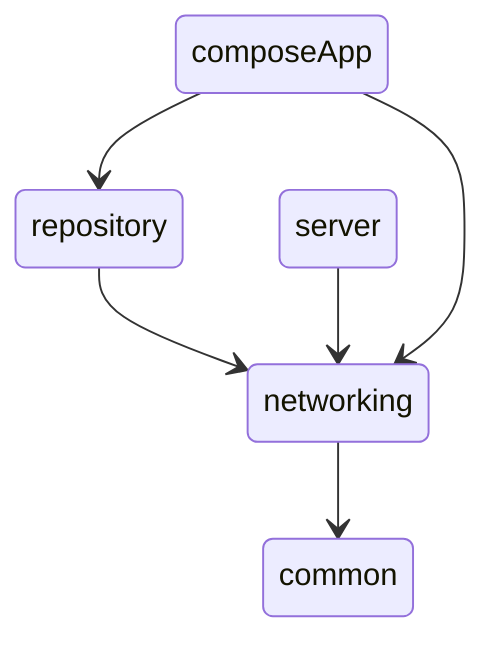

A simple app that demonstrates pagination and bluetooth connectivity. Harnessing JUUL Labs Kable, we are able to have multiplatform support for bluetooth. 
Backend is powered by ktor.

Supports:
1. Offline support
2. Pagination
3. Bluetooth Scanning

Written with Kotlin multiplatform, this currently runs on iOS and Android. 

To run the backend, run the command:
```shell
./gradlew server:run
```


## Architecture

